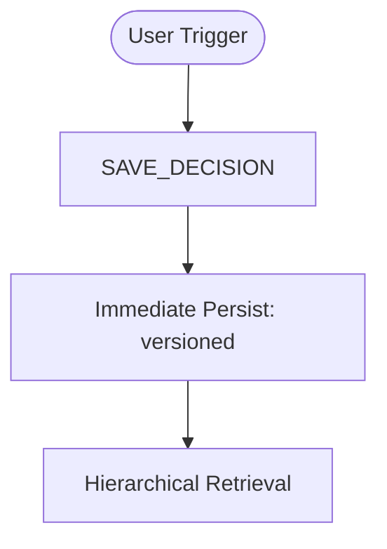
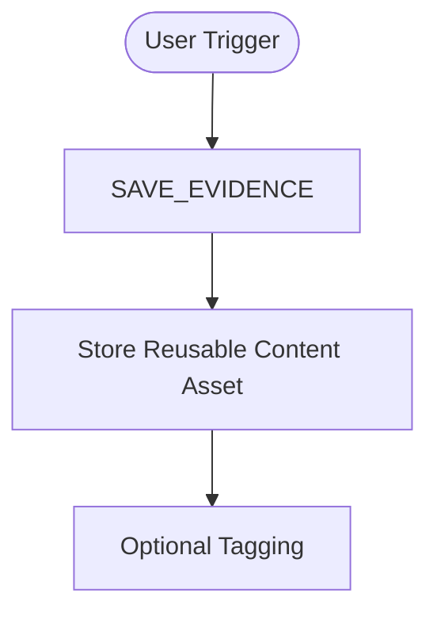
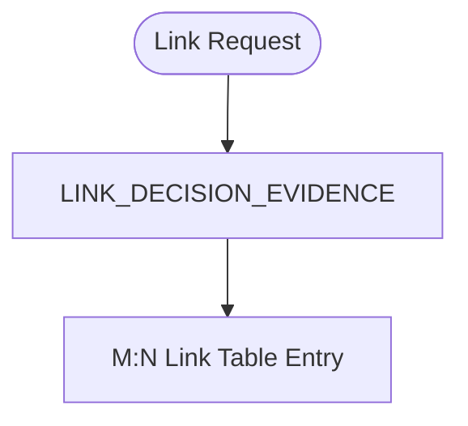
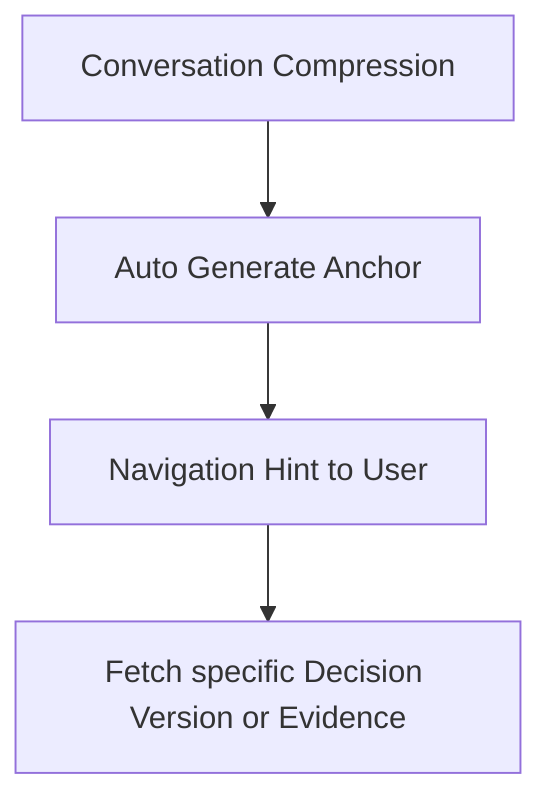

# C-005: Decision / Evidence Engine Intent Map

## 1. Problem Recognition (The Why)
- **Asset Independence**: 유용한 지식 자산(Evidence)이 특정 규칙(Decision)에묶여 재사용성이 저하되는 현상 방지.
- **Contextual Navigation**: Letta가 요약한 대화 맥락이 실제 영구 데이터(Meaning SSOT)로 이어지는 이정표 역할 필요.
- **Phase/Domain Separation**: Phase (execution stage) influences workflow routing, while Domain influences Decision applicability. These two axes are orthogonal and independent.

## 2. Intent Flow (Independent Lifecycles)

### Decision Lifecycle

### Evidence Lifecycle

### Optional Association (Link)

### Anchor (Letta Layer)

## 3. Risks & Guards
- **Entity Entanglement**: 두 개체의 생명주기가 섞이는 리스크 -> 테이블 물리 분리 및 독립 저장 유효성(Validation) 보장.
- **Link Integrity**: 잘못된 ID 링크 리스크 -> 링크 생성 시 존재 여부 애플리케이션 검증 강제.
- **Summary Contamination**: 요약 데이터 유입 리스크 -> Schema Whitelist 및 Summary 필드 완전 배제.
