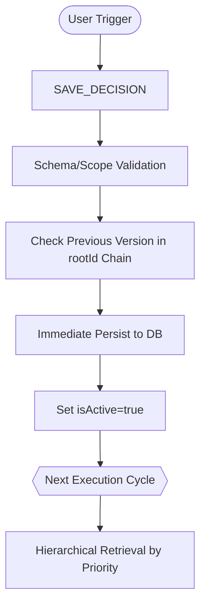
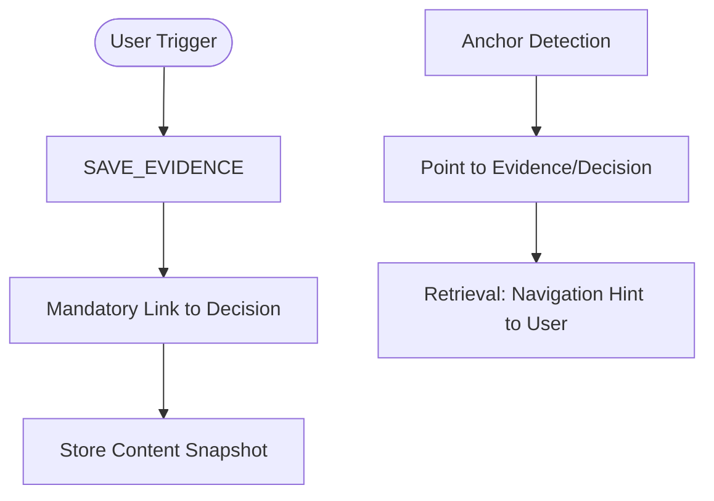

# C-005: Decision / Evidence Engine Intent Map

## 1. Problem Recognition (The Why)
- **Context Drift**: 프로젝트가 진행됨에 따라 초기 설계 의도(Meaning)가 희석되거나 변질되는 것을 방지함.
- **Legacy Summary Limitation**: 과거 Summary 기반 접근 방식은 "왜 그런 결정을 내렸는가"에 대한 논리적 근거(Evidence)를 구조적으로 보존하지 못함.

## 2. Intent Flow (Decision Lifecycle)

이 시스템의 핵심 의도는 대화 중 발생하는 '의미 있는 결정'을 즉시 포착하고 보존하는 것이다.

## 3. Intent Flow (Evidence & Anchor)

근거(Evidence)와 이정표(Anchor)는 결정을 보강하고 상기시키는 역할을 수행한다.

## 4. Risks & Guards (The How to Prevent)
- **Summary Contamination**: 요약 로직이 혼입될 리스크를 방지하기 위해 `SummarizeMemory` 노드를 완전히 배제하고, Schema Whitelist로 방어함.
- **Decision Chain Corruption**: `root_id` 무결성이 깨지는 리스크를 방지하기 위해 `Root Identity Rule` 및 `No Root Mutation` 계약을 강제함.
- **Priority Inversion**: 일반 결정이 Axis 철학을 덮어쓰는 리스크를 방지하기 위해 4단계 계층적 로딩(Hierarchical Loading) 및 정렬 규칙을 준수함.
- **Silent Failure**: 저장 및 검색 로직의 오류가 묵인되는 리스크를 방지하기 위해 **Fail-Fast** 원칙을 엄격히 적용함.
